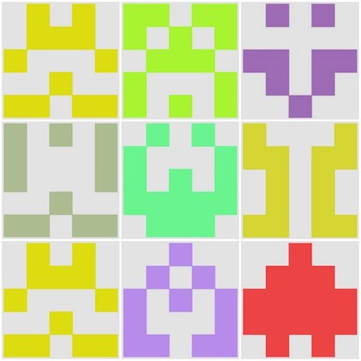

# avatar-gm
***

简单的头像处理工具，依赖 [GraphicsMagic](http://www.graphicsmagick.org/).

## avatar-gm可以做什么

使用avatar-gm，可以

**生成随机头像**



**根据数量拼接头像**


## 安装graphicsmagick

avatar-gm依赖于[GraphicsMagic](http://www.graphicsmagick.org/)，使用前需要安装graphicsmagick，安装方法详见[Installing GraphicsMagic](http://www.graphicsmagick.org/README.html).


## 测试

```shell
git clone https://github.com/ManerFan/avatar-gm.git
cd avatar-gm
npm install
npm run test
```


## 如何使用

avatar-gm依赖于[GraphicsMagic](http://www.graphicsmagick.org/)，GraphicsMagic的使用见[GraphicsMagic Gm Utility](http://www.graphicsmagick.org/GraphicsMagick.html)，node组件使用见[GraphicsMagic for NodeJS](http://aheckmann.github.io/gm/docs.html).


### 生成随机头像

```javascript
const {generate} = require('../');

_print = (output) => console.info(output);

generate().then(_print);
generate(path.join(__dirname, "generate")).then(_print);
generate(path.join(__dirname, "generate/avatar.jpg")).then(_print);
```


### 根据数量拼接头像

```javascript
const fs = require('fs');
const path = require('path');

const Promise = require('bluebird');

const {composite} = require('../');

_print = (output) => console.info(output);

let pics = fs.readdirSync(path.join(__dirname, 'assets'));
pics = pics.map((pic) => {
    return path.join(__dirname, 'assets', pic);
});

Promise.mapSeries(pics, (pic, index) => {
    return composite(pics.slice(0, index + 1), path.join(__dirname, 'composite', `composite${index + 1}.png`));
}).then(_print);
```


